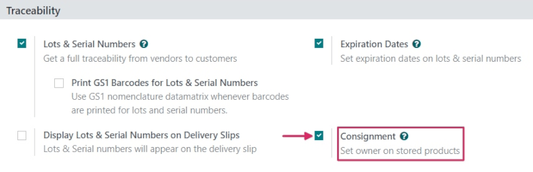
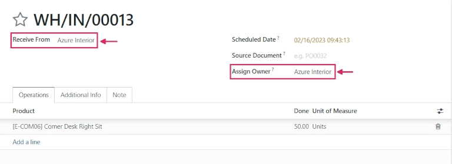
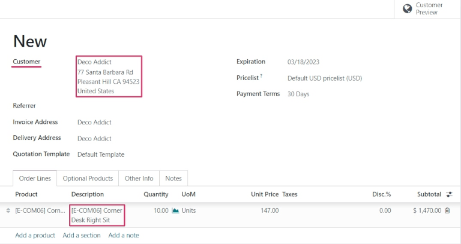
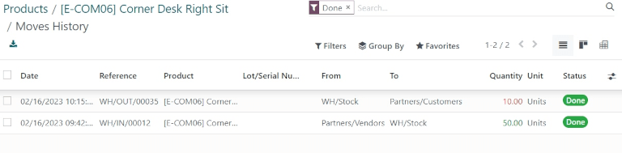

=================================================
Consignment: Buy and sell stock without owning it
=================================================

Most of the time, products stored in a company's warehouse are either purchased from suppliers, or
are manufactured in-house. However, suppliers will sometimes let companies store and sell products
in their warehouse, without having to buy those items up front. This is called *Consignment*.

Consignment is a great way for suppliers to launch new products, and easily get them out to their
customers. It's also a great way for the company storing the products (the consignee) to earn
something back for their efforts. Consignees can even charge a fee for the convenience of storing
products they don't actually own.

Configuration
=============

To receive, store, and sell consignment stock, the :guilabel:`Consignment` feature needs to be
enabled. To enable this, go to :menuselection:`Inventory --> Configuration --> Settings`, and under
the :guilabel:`Traceability` section, check the box next to :guilabel:`Consignment`, and click
:guilabel:`Save`.

Receive (and store) consignment stock
=====================================

With the :guilabel:`Consignment` feature enabled, consignment stock can now be received into a
warehouse. From the main :guilabel:`Inventory` dashboard, click into the :guilabel:`Receipts`
section. Then, click :guilabel:`Create`.

.. note::
    Consignment stock is not actually purchased from the vendor; it is simply received and stored.
    Because of this, there are no quotations or purchase orders involved in receiving consignment
    stock. So, *every* receipt of consignment stock will start by creating manual receipts.

Choose a vendor to enter in the :guilabel:`Receive From` field, then choose the same vendor to
enter in the :guilabel:`Assign Owner` field.

.. important::
    Since the products received from the vendor will be owned by the same vendor, the
    :guilabel:`Receive From` and :guilabel:`Assign Owner` fields must match.

Once the vendor-related fields are set, enter products into the :guilabel:`Product` lines, and set
the quantities to be received into the warehouse under the :guilabel:`Done` column. If the
:guilabel:`Units of Measure` feature is enabled, the :abbr:`UoM (Units of Measure)` can be changed,
as well. Once everything has been set, :guilabel:`Validate` the receipt.

Sell and deliver consignment stock
==================================

Once it's been received into the warehouse, consignment stock can be sold the same as any other
product. To create a sales order, navigate to the :guilabel:`Sales` app, and from the
:guilabel:`Quotations` overview, click :guilabel:`Create`.

Fill out all the information on the new quotation, and choose a customer to enter into the
:guilabel:`Customer` field.

.. note::
    The :guilabel:`Customer` *must* be different from the :guilabel:`Vendor` that supplied the
    consignment stock received (and stored) in the warehouse.

Add the consignment product to the :guilabel:`Product` lines, set the :guilabel:`Quantity`, and any
other pertinent product details. Once everything has been filled out, click :guilabel:`Confirm`.

Once the :abbr:`RFQ (Request for Quotation)` has been confirmed, it will become a sales order. From
here, the products can be delivered by clicking on the :guilabel:`Delivery` smart button, and
invoices can be created and sent to the customer.

Traceability and reporting of consignment stock
===============================================

Although consignment stock is owned by the vendor who supplied it, and not by the company storing
it in their warehouse, consignment products will *still* appear in certain inventory reports.

To find inventory reports, go to :menuselection:`Inventory --> Reporting`, and choose a report to
view.

.. note::
    Since the consignee does not actually own consigment stock, these products are *not* reflected
    in the :guilabel:`Stock Valuation` report, and have no impact on the consignee's inventory
    valuation.

Product moves report
--------------------

To view the :guilabel:`Product Moves` report, go to :menuselection:`Inventory --> Reporting -->
Product Moves`. From this report, all information about stock on-hand can be seen. For
consignment products, the information in this report is the same as any other product: the history
of its product moves can be reviewed; any replenishment rules are listed; and its
:guilabel:`Locations` are available, as well.

.. tip::
    To see forecasted units of consignment stock, go to :menuselection:`Inventory --> Reporting -->
    Forecasted Inventory`.

Stock on hand report
--------------------

To view the :guilabel:`Stock On Hand` report, go to :menuselection:`Inventory --> Reporting -->
Inventory Report`. From this report, the :guilabel:`Locations` of all stock on-hand are displayed,
in addition to the quantities per location. For consigment products, the :guilabel:`Owner` column
will be populated with the owner of those products, or the original vendor who supplied the
products in the first place.
