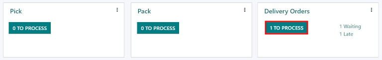

=================================
Process deliveries in three steps
=================================

Some companies process a large amount of deliveries a day, each including many products, and require
special packaging. To make this efficient, a packing step is needed before shipping out products.
For this, Odoo has a three step process for delivering goods.

In the three step delivery process, products which are part of a delivery order are picked in the
warehouse according to the removal strategy, and brought to a packing zone. After the items have
been packed into the different shipments in the packing zone, they are brought to an output location
before being shipped.

Configuration
=============

Odoo is configured by default to :doc:`receive and deliver goods in one step
<receipts_delivery_one_step>`, so the settings need to be changed in order to utilize three step
deliveries. First, make sure the :guilabel:`Multi-Step Routes` option is enabled in
:menuselection:`Inventory --> Configuration --> Settings --> Warehouse`. Note that activating
:guilabel:`Multi-Step Routes` will also activate :guilabel:`Storage Locations`.

.. image:: delivery_three_steps/multi-step-routes.png
   :align: center
   :alt: Activate multi-step routes and storage locations in inventory settings.

Next, the warehouse needs to be configured for three step deliveries. Go to
:menuselection:`Inventory --> Configuration --> Warehouses`, edit the warehouse, then, select
:guilabel:`Pack goods, send goods in output and then deliver (3 steps)` for
:guilabel:`Outgoing Shipments`, then save the changes.

.. image:: delivery_three_steps/three-step-warehouse-config.png
   :align: center
   :alt: Set incoming and outgoing shipment options to receive and deliver in three steps.

Activating three step receipts and deliveries will create two new internal locations, a
:guilabel:`Packing Zone` (WH/Packing Zone), and :guilabel:`Output` (WH/Output). To rename these
locations, go to :menuselection:`Configuration --> Locations`, select the location to change, click
:guilabel:`Edit`, update the name, and finally, click :guilabel:`Save`.

Process a delivery order in three steps (pick + pack + ship)
============================================================

Create a sales order
--------------------

In the :guilabel:`Sales` application, create a new quote by clicking :guilabel:`Create`. Select a
customer, add a storable product, and click :guilabel:`Confirm`.

A :guilabel:`Delivery` smart button will appear in the top right. Clicking on the
:guilabel:`Delivery` smart button will show both the picking order, packing order, and the delivery
order, which are all associated with the sales order.

.. image:: delivery_three_steps/three-step-delivery-so.png
   :align: center
   :alt: After confirming the sales order, the Delivery smart button appears showing three items
         associated with it.

Process a Picking
-----------------

The picking, packing, and delivery orders will be created once the sales order is confirmed.  To
view these transfers, go to :menuselection:`Inventory --> Operations --> Transfers`.

.. image:: delivery_three_steps/three-step-delivery-transfers.png
   :align: center
   :alt: Ready status for the pick operation while the packing and delivery operations are waiting
         another operation.

The status of the picking will be :guilabel:`Ready`, since the product must be picked from stock
before it can be packed. The status of the packing order and delivery order will both be
:guilabel:`Waiting Another Operation`, since the packing and delivery cannot happen until the
picking is completed. The status of the delivery order will only change to :guilabel:`Ready` when
the packing has been marked :guilabel:`Done`.

The receipt can also be found in the :guilabel:`Inventory` application. In the overview dashboard,
click the :guilabel:`1 To Process` smart button in the :guilabel:`Pick` Kanban card.

.. image:: delivery_three_steps/three-step-kanban-pick.png
   :align: center
   :alt: The pick order can be seen in the Inventory Kanban view.

Click on the picking to process. If the product is in stock, Odoo will automatically reserve the
product. Click :guilabel:`Validate` to mark the picking as done, and complete the transfer to the
:guilabel:`Packing Zone`. Then the packing order will be ready. Since the documents are linked, the
products which have been previously picked are automatically reserved on the packing order.

.. image:: delivery_three_steps/validate-three-step-pick.png
   :align: center
   :alt: Validate the picking by clicking Validate.

Process a Packing
-----------------

The packing order will be ready to be processed once the picking is completed, and can be found in
the :guilabel:`Inventory` application overview dashboard. Click the :guilabel:`1 To Process` smart
button in the :guilabel:`Pack` Kanban card.

.. image:: delivery_three_steps/three-step-kanban-pack.png
   :align: center
   :alt: The packing order can be seen in the Inventory Kanban view.

Click on the packing order associated with the sales order, then click on :guilabel:`Validate` to
complete the packing.

         output location.

Once the packing order is validated, the product leaves the :guilabel:`WH/Packing Zone` location and
moves to the :guilabel:`WH/Output` location. Then, the status of the document will change to
:guilabel:`Done`.

Process a Delivery
------------------

The delivery order will be ready to be processed once the packing is completed, and can be found in
the :guilabel:`Inventory` application overview dashboard. Click the :guilabel:`1 To Process` smart
button in the :guilabel:`Delivery Orders` Kanban card.

Click on the delivery order associated with the sales order, then click on :guilabel:`Validate` to
complete the move.

.. image:: delivery_three_steps/three-step-delivery-out.png
   :align: center
   :alt: Click Validate on the delivery order to transfer the product from the output location to the
         customer location.

Once the delivery order is validated, the product leaves the :guilabel:`WH/Output` location and
moves to the :guilabel:`Partners/Customers` location. Then, the status of the document will change
to :guilabel:`Done`.
