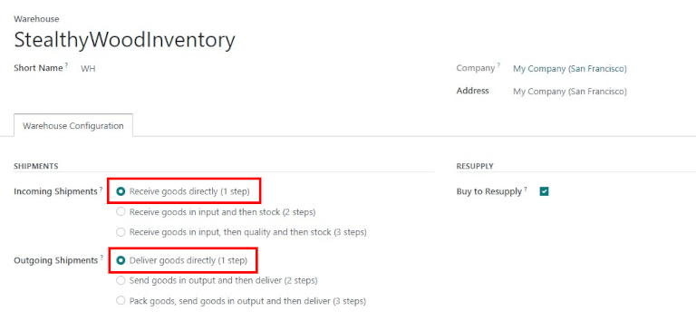
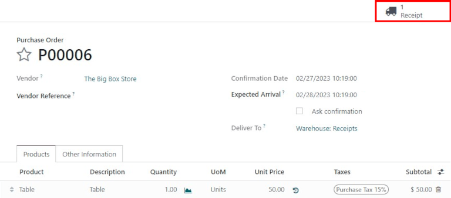
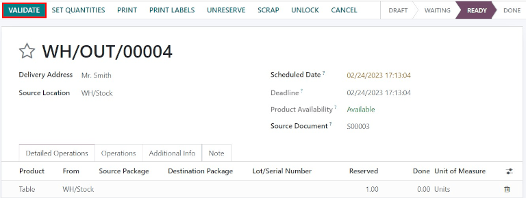

===========================================
Process receipts and deliveries in one step
===========================================

There is no configuration needed to receive or deliver products in one step. The default incoming
and outgoing shipments are configured to be directly received into stock, and directly delivered
from the stock to the customer.

Both incoming and outgoing shipments do not need to be configured to have the same steps. For
example products can be received in one step, but shipped in three steps. In the following example,
one step will be used for both receipts and deliveries.

Configuration
=============

If another receiving or shipping configuration is set on the warehouse, they can easily be set back
to one step. Go to :menuselection:`Inventory --> Configuration --> Warehouses`, click on the
warehouse to edit, then, click :guilabel:`Edit`. Select :guilabel:`Receive goods directly (1 step)`
for :guilabel:`Incoming Shipments` and :guilabel:`Deliver goods directly (1 step)` for
:guilabel:`Outgoing Shipments`, then save the changes

Receive goods directly (1 step)
===============================

Create a purchase order
-----------------------

In the :guilabel:`Purchase` application, create a new quote by clicking :guilabel:`Create`. Select a
vendor, add a storable product, and click :guilabel:`Confirm Order`.

A :guilabel:`Receipt` smart button will appear in the top right, and the receipt will be associated
with the purchase order. Clicking on the :guilabel:`Receipt` smart button will show the receipt
order.

Process a receipt
-----------------

The receipt can also be found in the :guilabel:`Inventory` application. In the overview dashboard,
click the :guilabel:`1 to Process` smart button in the :guilabel:`Receipts` Kanban card.

.. image:: receipts_delivery_one_step/one-step-to-process-btn.png
   :align: center
   :alt: Receipt Kanban card's :guilabel:`1 to Process` smart button.

Click on the receipt associated with the purchase order, then click :guilabel:`Validate` to complete
the receipt.

.. image:: receipts_delivery_one_step/one-step-po-validate.png
   :align: center
   :alt: Validate the purchase order via the Validate smart button.

.. note::
   If :guilabel:`Storage Locations` are activated, clicking the :guilabel:`Details` icon next to the
   :guilabel:`Delete` icon enables the :guilabel:`Detailed Operations` screen to pop-up. This allows
   the location(s) to be specified for the received product(s).

.. image:: receipts_delivery_one_step/receive-storage-location.png
   :align: center
   :alt: Select the Storage Location for the products being received in the Detailed Operations
         pop-up.

Once the receipt is validated, the product leaves the :guilabel:`Supplier Location` and enters the
:guilabel:`WH/Stock Location` and will be available for manufacturing, sales, etc. Then, the status
of the document will change to :guilabel:`Done`.

Deliver goods directly (1 step)
===============================

Create a sales order
--------------------

In the :guilabel:`Sales` application, create a quote by clicking :guilabel:`Create`. Select a
customer, add a storable product that is in stock, and click :guilabel:`Confirm`.

A :guilabel:`Delivery` smart button will appear in the top right, and the delivery order will be
associated with the sales order. Clicking on the :guilabel:`Delivery` smart button will show the
delivery order.

.. image:: receipts_delivery_one_step/one-step-sales-order.png
   :align: center
   :alt: The Delivery smart button appears after the sales order is confirmed.

Process a delivery
------------------

The delivery order can also be found in the :guilabel:`Inventory` application. In the overview
dashboard, click the :guilabel:`1 to Process` smart button in the :guilabel:`Delivery Orders` Kanban
card.

.. image:: receipts_delivery_one_step/one-step-to-process-btn.png
   :align: center
   :alt: Delivery Orders Kanban card's :guilabel:`1 to Process` smart button.

Click on the delivery order associated with the sales order, then click on :guilabel:`Validate` to
complete the move.

Once the picking order is validated, the product leaves the :guilabel:`WH/Stock location` and moves
to the :guilabel:`Partners/Customers location`. Then, the status of the document will change to
:guilabel:`Done`.
