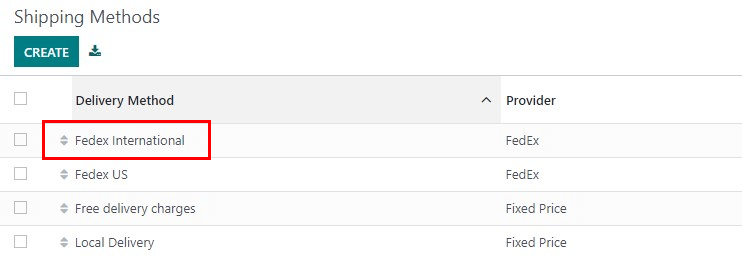
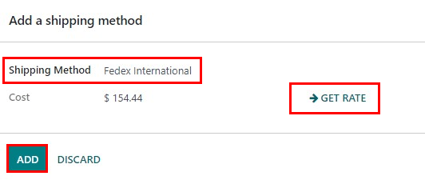
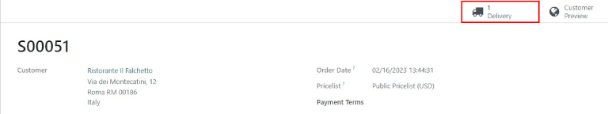
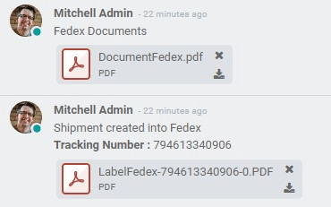
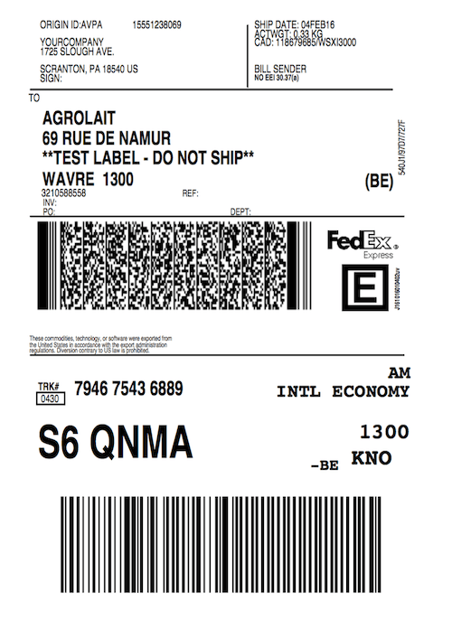
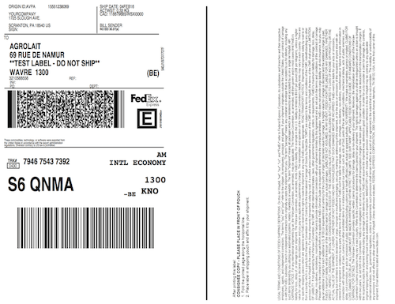

=====================================
How to change the shipping label size
=====================================

Overview
========

With Odoo, there are a variety of different types of shipping  labels that can be selected for
delivery orders. Depending on the types of shipping packages used, different label sizes may be more
appropriate, and can be easily configured in Odoo.

Configuration
=============

In the :guilabel:`Inventory` module, go to :menuselection:`Configuration --> Delivery --> Shipping
Methods.` Choose a delivery method and then click :guilabel:`Edit`. For the following example,
*FedEx International* will be used. Choose a delivery method and then click on :guilabel:`Edit`.

In the :guilabel:`Configuration` tab, under :guilabel:`Label Type`, choose one of the label types
available. The availability will vary depending on the carrier. Save the changes.

.. image:: label_type/label-type-dropdown.png
   :align: center
   :alt: Select a label type.

When a *sales order* with the corresponding shipping company is confirmed, and the *delivery order*
is validated, the shipping label will be automatically created as a PDF and appear in the
:guilabel:`Chatter`.

Create a Sales Order
====================

In the :guilabel:`Sales` application, create a quotation for an international customer with a
storable product. Click on :guilabel:`Create`, and select an international customer for the quote.
Click :guilabel:`Add A Product` and select an item. Click :guilabel:`Add Shipping`, select a
shipping method, then click :guilabel:`Get Rate`, and finally click :guilabel:`Add`.

Once the quotation is confirmed by clicking :guilabel:`Confirm`, a :guilabel:`Delivery` smart button
will appear.

Once the delivery order is validated by clicking :guilabel:`Validate` in the delivery order, the
shipping documents appear in the :guilabel:`Chatter`.

Example labels
==============

The default :guilabel:`Label Type` is `Paper Letter`. An example of a FedEx letter sized label is:

For comparison, an example of a FedEx bottom-half label is:

