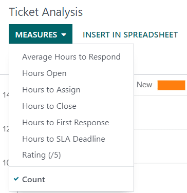
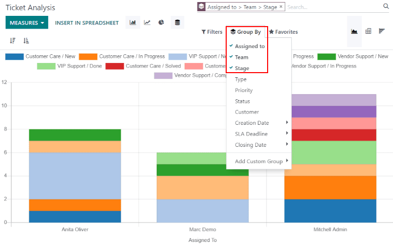
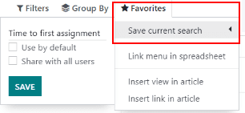

=========
Reporting
=========

Odoo :guilabel:`Helpdesk` features several reports that provide the opportunity to track trends,
identify areas for improvement, manage employees` workloads, and confirm when customer expectations
are met.

Available reports
=================

The reports below can be found under :menuselection:`Helpdesk --> Reporting`.

Tickets Analysis
----------------

The :guilabel:`Tickets Analysis` report provides an overview of every ticket in the database. The
default report counts the number of tickets per team and groups them by stage.

.. image:: reports/reports-tickets-default.png
   :align: center
   :alt: View of Tickets Analysis report default view

Alternative measures can be selected to track where the most time is spent at different points in
the workflow. To change the metric used in the current report, choose an option from the
:guilabel:`Measures` dropdown.

To sort tickets by the user assigned to them, select :menuselection:`Group by --> Assigned to`.
Additional criteria can be selected from the :guilabel:`Group By` dropdown in order to get a more
detailed overview of the current workload of every member of the support team.

SLA Status Analysis
-------------------

The :guilabel:`SLA Status Analysis` report tracks how quickly an SLA is fulfilled, as well as the
success rate of individual policies. By default, the report is filtered to show the number of SLAs
failed and the failure rate over the last 30 days, grouped by team.

.. image:: reports/reports-sla-status.png
   :align: center
   :alt: View of Group by options of Tickets Analysis report

To add additional measures, click :guilabel:`Measures` and choose and option from the drop down. To
add an additional group at the row level, click :guilabel:`Total`.

.. example::
   To see the number of tickets that were able to achieve the stated SLA objectives, and track the
   amount of time it took to achieve those objectives, click
   :menuselection:`Measures --> Number of SLA Successful` and
   :menuselection:`Measures --> Workings Hours to Reach SLA`.
   To sort these results by the team members assigned to the tickets, select
   :menuselection:`Total --> Assigned to`.

Customer Ratings
----------------

The :guilabel:`Customer Ratings` report displays an overview of the ratings received on individual
tickets, as well as any additional comments submitted with the rating.

.. image:: reports/reports-customer-ratings.png
   :align: center
   :alt: View of the kanban display in the Customer Ratings report

Click on an individual rating to see additional details, including a link to the original ticket.

.. image:: reports/reports-ratings-details.png
   :align: center
   :alt: View of the details of an individual customer rating

.. tip::
   Select :guilabel:`Visible Internally Only` to hide a rating from the customer portal.

Save filters
============

The :guilabel:`Favorites` feature allows users to save the most commonly used filters without
having to reconstruct them every time they are needed.
To create a new favorite:

   - Set the necessary parameters using the :guilabel:`Filters`, :guilabel:`Group By` and
     :guilabel:`Measures`.
   - Click :menuselection:`Favorites --> Save current search`.
   - Rename the search.
   - Select :guilabel:`Use by default` to have these filter settings automatically displayed whenever
     the report is opened. Otherwise, leave it blank.
   - Select :guilabel:`Share with all users` to make this filter available to all other database
     users. If this box is not checked, it will only be available to the user who creates it.
   - Click :guilabel:`Save`.

.. seealso::
   - :doc:`receiving_tickets`
   - :doc:`sla`
   - :doc:`ratings`
   - :doc:`Odoo Reporting </applications/general/reporting>`
